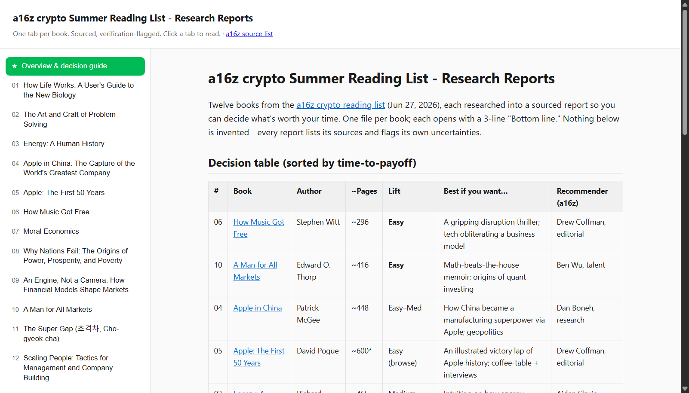

# Summer Reading List - Researched

Sourced research reports on the 12 books from the [a16z crypto summer reading list](https://a16zcrypto.substack.com/p/a-reading-list-for-the-deeply-curious), built to help decide which are worth reading when time is premium.

**[View the live page](https://az9713.github.io/summer-reading-list/)** - the tabbed viewer, hosted on GitHub Pages.

## What's here

- **`reading-list.html`** - a self-contained, offline tabbed viewer. One tab per book plus an overview tab. Open it directly in any browser (no server, no internet needed; the Markdown renderer is vendored inline).
- **`reports/`** - one Markdown report per book, plus `reports/README.md`, the overview and decision guide (comparison table sorted by time-to-payoff, flags, and a recommended reading path).

## The reports

Each report opens with a 3-line "Bottom line," then covers the thesis, structure, reception, length/time investment, and an honest "Open questions" section. Every report lists its sources. Nothing is invented - claims are sourced and uncertainties are flagged (e.g. brand-new titles with thin reception, or a book with no verified English translation).

## Source

The book list is from a16z crypto: ["A reading list for the deeply curious"](https://a16zcrypto.substack.com/p/a-reading-list-for-the-deeply-curious). The research and reports in this repo are independent and not affiliated with a16z.
